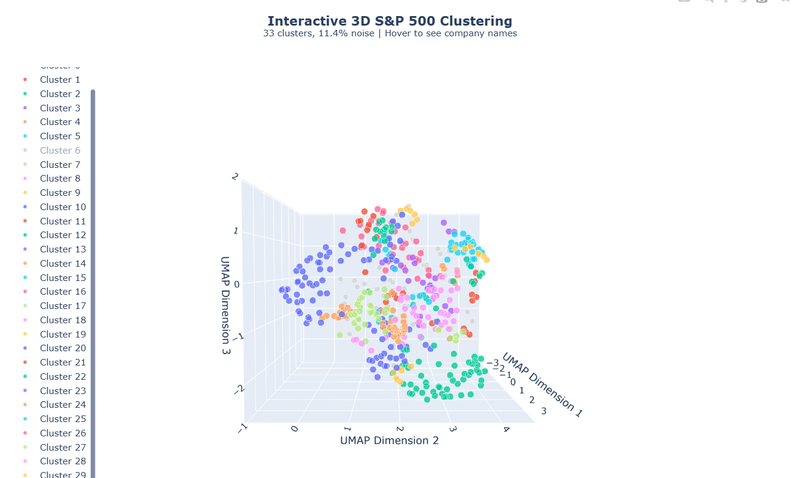

# Wiki_Vectors

Screenshots of an interactive 3D Graph viewed from different angles

Each high dimensional company vector (~1500 dims) was reduced down to 3 dimensions for the sake of graphing, clustering was done in a higher dimension

# S&P 500 Embedding Clustering Analysis

## Overview

This analysis clusters S&P 500 companies based on embedding similarity, revealing natural groupings within the index.

**Dataset Statistics:**
- Total companies: 503
- Number of clusters: 34
- Outliers/noise: 39 companies (7.8%)
- Largest cluster: 34 companies
- Smallest cluster: 5 companies
- Average cluster size: 13.6 companies

---

## Outliers (39 companies)

Companies that don't fit neatly into any cluster:

ALLE, APH, AMAT, APTV, ADSK, AVY, T, AXON, CHTR, GLW, DVA, DHI, EBAY, EA, EQIX, GDDY, HST, JBL, J, KVUE, KLAC, LRCX, LEN, MSI, NVR, POOL, PHM, PTC, RSG, ROP, ROL, TMUS, SYY, VLTO, VRSN, VZ, GWW, WM, WY

---

## Clusters

### Cluster 0: Energy & Chemicals (23 companies)
Oil, gas, energy production, and industrial gases

APD, APA, BKR, CVX, COP, CTRA, DVN, FANG, EQT, EOG, XOM, EXE, HAL, KMI, LIN, MPC, OXY, OKE, PSX, SLB, TRGP, VLO, WMB

### Cluster 1: Utilities & Power (34 companies)
Electric utilities, energy infrastructure, and power generation

AES, LNT, AEP, AEE, AWK, ATO, CNP, CMS, ED, CEG, D, DTE, DUK, EIX, ETR, EME, ES, EVRG, EXC, FE, GEV, NEE, NI, NRG, PCG, PPL, PNW, PEG, PWR, SRE, SO, VST, WEC, XEL

### Cluster 2: Retail & Consumer Goods (20 companies)
Department stores, specialty retail, and consumer brands

BBY, COST, DECK, DG, DLTR, EL, HD, KR, LOW, LULU, NKE, RL, ROST, TPR, TGT, TJX, TSCO, ULTA, WMT, WSM

### Cluster 3: Transportation & Logistics (14 companies)
Airlines, freight, and package delivery

CHRW, CSX, DAL, EXPD, FDX, JBHT, NSC, ODFL, LUV, TPL, UBER, UNP, UPS, UAL

### Cluster 4: Restaurants (6 companies)
Quick service and casual dining

CMG, DRI, DASH, DPZ, MCD, YUM

### Cluster 5: Real Estate (28 companies)
REITs, property management, and real estate services

ARE, AMT, AVB, BXP, CPT, CBRE, CSGP, CCI, DLR, EQR, ESS, EXR, FRT, DOC, INVH, KIM, MAA, PLD, PSA, REG, O, SBAC, SPG, UDR, URI, VICI, VTR, WELL

### Cluster 6: Healthcare Services (13 companies)
Health insurance, pharmacy benefits, and healthcare facilities

CAH, COR, CNC, CI, CVS, ELV, HSIC, HCA, HUM, MCK, MOH, UNH, UHS

### Cluster 7: Pharmaceuticals & Biotech (14 companies)
Drug development and biopharmaceuticals

ABBV, AMGN, BIIB, BMY, GILD, INCY, LLY, MRK, MRNA, PFE, REGN, VTRS, VRTX, ZTS

### Cluster 8: Consumer Staples (9 companies)
Household products and tobacco

MO, CHD, CTAS, CLX, CL, ECL, KMB, PM, PG

### Cluster 9: Chemicals & Materials (8 companies)
Specialty chemicals and coatings

MMM, ALB, DD, EMN, DOW, LYB, PPG, SHW

### Cluster 10: Food & Agriculture (18 companies)
Food processing, agriculture, and packaged foods

ADM, BG, CPB, CF, CAG, CTVA, GIS, HSY, HRL, IFF, K, LW, KHC, MKC, MDLZ, MOS, SJM, TSN

### Cluster 11: Medical Devices (20 companies)
Medical equipment and surgical devices

ABT, ALGN, BAX, BSX, COO, DXCM, EW, GEHC, HOLX, PODD, ISRG, JNJ, IQV, MDT, RMD, SOLV, STE, SYK, WST, ZBH

### Cluster 12: Life Sciences Tools (11 companies)
Laboratory equipment and diagnostics

A, BDX, TECH, CRL, DHR, IDXX, LH, DGX, RVTY, TMO, WAT

### Cluster 13: Packaging (5 companies)
Paper and packaging materials

AMCR, BALL, IP, PKG, SW

### Cluster 14: Beverages (8 companies)
Soft drinks, coffee, and alcoholic beverages

BF.B, KO, STZ, KDP, TAP, MNST, PEP, SBUX

### Cluster 15: Building Materials & Metals (13 companies)
Construction materials and industrial metals

BLDR, FAST, FCX, ITW, MLM, MAS, MHK, NEM, NUE, SNA, SWK, STLD, VMC

### Cluster 16: Automotive & Industrial (14 companies)
Auto manufacturers, parts, and industrial equipment

AZO, KMX, CAT, CPRT, CMI, DE, FSLR, F, GPC, GM, LKQ, ORLY, PCAR, TSLA

### Cluster 17: Industrial Conglomerates (20 companies)
HVAC, electrical equipment, and industrial machinery

AOS, CARR, DOV, ETN, EMR, GNRC, HON, HUBB, IEX, IR, JCI, LII, NDSN, OTIS, PH, PNR, ROK, TT, WAB, XYL

### Cluster 18: Hospitality & Entertainment (13 companies)
Hotels, casinos, cruise lines, and entertainment venues

ABNB, BKNG, CCL, EXPE, HLT, LVS, L, LYV, MAR, MGM, NCLH, RCL, WYNN

### Cluster 19: Exchanges & Trading Platforms (8 companies)
Financial exchanges and trading infrastructure

BR, CBOE, CME, COIN, ICE, IBKR, NDAQ, HOOD

### Cluster 20: Financial Data & Analytics (9 companies)
Credit ratings, financial data, and risk analytics

EFX, FDS, FICO, FIS, FI, MCO, MSCI, SPGI, VRSK

### Cluster 21: Insurance (20 companies)
Property & casualty, life insurance, and insurance brokers

AFL, ALL, AIG, AON, ACGL, AJG, AIZ, BRK.B, BRO, CB, CINF, ERIE, EG, GL, HIG, MET, PGR, TRV, WRB, WTW

### Cluster 22: Asset Management (12 companies)
Investment management and private equity

AMP, APO, BX, BLK, BEN, IVZ, KKR, MMC, PFG, PRU, RJF, TROW

### Cluster 23: Wealth Management (5 companies)
Brokerage and custody services

SCHW, GS, MS, NTRS, STT

### Cluster 24: Banking & Payments (24 companies)
Consumer banks, payment processors, and credit cards

AXP, BAC, XYZ, BK, COF, C, CFG, CPAY, FITB, GPN, HBAN, JKHY, JPM, KEY, MTB, MA, PYPL, PNC, RF, SYF, TFC, USB, V, WFC

### Cluster 25: Digital Advertising (6 companies)
Social media, advertising, and digital marketing

APP, IPG, MTCH, META, OMC, TTD

### Cluster 26: Media & Entertainment (12 companies)
Broadcasting, streaming, and entertainment content

CMCSA, FOXA, FOX, HAS, NFLX, NWS, NWSA, PSKY, TTWO, TKO, WBD, DIS

### Cluster 27: HR & Payroll Software (8 companies)
Human capital management and payroll services

ADP, DAY, EPAM, INTU, PAYX, PAYC, NOW, WDAY

### Cluster 28: Test & Measurement (10 companies)
Electronic testing equipment and precision instruments

AME, FTV, GRMN, KEYS, MTD, TER, TEL, TRMB, TYL, ZBRA

### Cluster 29: Aerospace & Defense (13 companies)
Aircraft manufacturers and defense contractors

BA, GE, GD, HWM, HII, LHX, LDOS, LMT, NOC, RTX, TDY, TXT, TDG

### Cluster 30: Enterprise Software (6 companies)
Cloud software and enterprise applications

ACN, CTSH, DDOG, IT, ORCL, CRM

### Cluster 31: Tech Giants (6 companies)
Mega-cap technology platforms

ADBE, AMZN, GOOGL, GOOG, AAPL, MSFT

### Cluster 32: Cybersecurity & Networking (11 companies)
Network infrastructure and security software

AKAM, ANET, CSCO, CRWD, FFIV, FTNT, GEN, IBM, NTAP, PLTR, PANW

### Cluster 33: Semiconductors & Hardware (23 companies)
Chip manufacturers and computer hardware

AMD, ADI, AVGO, CDNS, CDW, DELL, HPE, HPQ, INTC, IRM, MCHP, MU, MPWR, NVDA, NXPI, ON, QCOM, STX, SWKS, SNPS, SMCI, TXN, WDC

---

## Notes

- Clustering performed using embedding-based similarity analysis
- Some companies may operate across multiple sectors but are grouped by their primary business characteristics
- The outlier group represents companies with unique business models or those spanning multiple industries