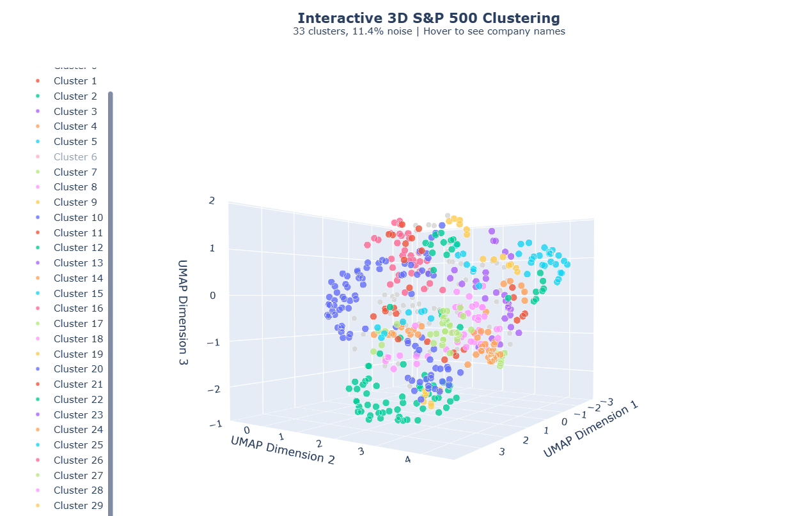

# Wiki_Vectors

Screenshots of an interactive 3D Graph viewed from different angles

Each high dimensional company vector (~1500 dims) was reduced down to 3 dimensions for the sake of graphing, clustering was done in a higher dimension

=== S&P 500 Embedding Clustering Summary ===

Total companies: 503
Number of clusters (excluding noise): 34
Number of noise / outliers: 39 (7.8%)
Largest cluster size: 34
Smallest cluster size: 5
Average cluster size (excluding noise): 13.6

=== Outliers / Noise ===
 ALLE | Allegion
  APH | Amphenol
 AMAT | Applied Materials
 APTV | Aptiv
 ADSK | Autodesk
  AVY | Avery Dennison
    T | AT&T
 AXON | Axon Enterprise
 CHTR | Charter Communications
  GLW | Corning Inc.
  DVA | DaVita
  DHI | D. R. Horton
 EBAY | eBay Inc.
   EA | Electronic Arts
 EQIX | Equinix
 GDDY | GoDaddy
  HST | Host Hotels & Resorts
  JBL | Jabil
    J | Jacobs Solutions
 KVUE | Kenvue
 KLAC | KLA Corporation
 LRCX | Lam Research
  LEN | Lennar
  MSI | Motorola Solutions
  NVR | NVR, Inc.
 POOL | Pool Corporation
  PHM | PulteGroup
  PTC | PTC Inc.
  RSG | Republic Services
  ROP | Roper Technologies
  ROL | Rollins, Inc.
 TMUS | T-Mobile US
  SYY | Sysco
 VLTO | Veralto
 VRSN | Verisign
   VZ | Verizon
  GWW | W. W. Grainger
   WM | Waste Management
   WY | Weyerhaeuser
Total in this cluster: 39

=== Cluster 0 ===
  APD | Air Products
  APA | APA Corporation
  BKR | Baker Hughes
  CVX | Chevron Corporation
  COP | ConocoPhillips
 CTRA | Coterra
  DVN | Devon Energy
 FANG | Diamondback Energy
  EQT | EQT Corporation
  EOG | EOG Resources
  XOM | ExxonMobil
  EXE | Expand Energy
  HAL | Halliburton
  KMI | Kinder Morgan
  LIN | Linde plc
  MPC | Marathon Petroleum
  OXY | Occidental Petroleum
  OKE | Oneok
  PSX | Phillips 66
  SLB | Schlumberger
 TRGP | Targa Resources
  VLO | Valero Energy
  WMB | Williams Companies
Total in this cluster: 23

=== Cluster 1 ===
  AES | AES Corporation
  LNT | Alliant Energy
  AEP | American Electric Power
  AEE | Ameren
  AWK | American Water Works
  ATO | Atmos Energy
  CNP | CenterPoint Energy
  CMS | CMS Energy
   ED | Consolidated Edison
  CEG | Constellation Energy
    D | Dominion Energy
  DTE | DTE Energy
  DUK | Duke Energy
  EIX | Edison International
  ETR | Entergy
  EME | Emcor
   ES | Eversource Energy
 EVRG | Evergy
  EXC | Exelon
   FE | FirstEnergy
  GEV | GE Vernova
  NEE | NextEra Energy
   NI | NiSource
  NRG | NRG Energy
  PCG | PG&E Corporation
  PPL | PPL Corporation
  PNW | Pinnacle West Capital
  PEG | Public Service Enterprise Group
  PWR | Quanta Services
  SRE | Sempra
   SO | Southern Company
  VST | Vistra Corp.
  WEC | WEC Energy Group
  XEL | Xcel Energy
Total in this cluster: 34

=== Cluster 2 ===
  BBY | Best Buy
 COST | Costco
 DECK | Deckers Brands
   DG | Dollar General
 DLTR | Dollar Tree
   EL | Estée Lauder Companies (The)
   HD | Home Depot (The)
   KR | Kroger
  LOW | Lowe's
 LULU | Lululemon Athletica
  NKE | Nike, Inc.
   RL | Ralph Lauren Corporation
 ROST | Ross Stores
  TPR | Tapestry, Inc.
  TGT | Target Corporation
  TJX | TJX Companies
 TSCO | Tractor Supply
 ULTA | Ulta Beauty
  WMT | Walmart
  WSM | Williams-Sonoma, Inc.
Total in this cluster: 20

=== Cluster 3 ===
 CHRW | C.H. Robinson
  CSX | CSX Corporation
  DAL | Delta Air Lines
 EXPD | Expeditors International
  FDX | FedEx
 JBHT | J.B. Hunt
  NSC | Norfolk Southern
 ODFL | Old Dominion
  LUV | Southwest Airlines
  TPL | Texas Pacific Land Corporation
 UBER | Uber
  UNP | Union Pacific Corporation
  UPS | United Parcel Service
  UAL | United Airlines Holdings
Total in this cluster: 14

=== Cluster 4 ===
  CMG | Chipotle Mexican Grill
  DRI | Darden Restaurants
 DASH | DoorDash
  DPZ | Domino's
  MCD | McDonald's
  YUM | Yum! Brands
Total in this cluster: 6

=== Cluster 5 ===
  ARE | Alexandria Real Estate Equities
  AMT | American Tower
  AVB | AvalonBay Communities
  BXP | BXP, Inc.
  CPT | Camden Property Trust
 CBRE | CBRE Group
 CSGP | CoStar Group
  CCI | Crown Castle
  DLR | Digital Realty
  EQR | Equity Residential
  ESS | Essex Property Trust
  EXR | Extra Space Storage
  FRT | Federal Realty Investment Trust
  DOC | Healthpeak Properties
 INVH | Invitation Homes
  KIM | Kimco Realty
  MAA | Mid-America Apartment Communities
  PLD | Prologis
  PSA | Public Storage
  REG | Regency Centers
    O | Realty Income
 SBAC | SBA Communications
  SPG | Simon Property Group
  UDR | UDR, Inc.
  URI | United Rentals
 VICI | Vici Properties
  VTR | Ventas
 WELL | Welltower
Total in this cluster: 28

=== Cluster 6 ===
  CAH | Cardinal Health
  COR | Cencora
  CNC | Centene Corporation
   CI | Cigna
  CVS | CVS Health
  ELV | Elevance Health
 HSIC | Henry Schein
  HCA | HCA Healthcare
  HUM | Humana
  MCK | McKesson Corporation
  MOH | Molina Healthcare
  UNH | UnitedHealth Group
  UHS | Universal Health Services
Total in this cluster: 13

=== Cluster 7 ===
 ABBV | AbbVie
 AMGN | Amgen
 BIIB | Biogen
  BMY | Bristol Myers Squibb
 GILD | Gilead Sciences
 INCY | Incyte
  LLY | Lilly (Eli)
  MRK | Merck & Co.
 MRNA | Moderna
  PFE | Pfizer
 REGN | Regeneron Pharmaceuticals
 VTRS | Viatris
 VRTX | Vertex Pharmaceuticals
  ZTS | Zoetis
Total in this cluster: 14

=== Cluster 8 ===
   MO | Altria
  CHD | Church & Dwight
 CTAS | Cintas
  CLX | Clorox
   CL | Colgate-Palmolive
  ECL | Ecolab
  KMB | Kimberly-Clark
   PM | Philip Morris International
   PG | Procter & Gamble
Total in this cluster: 9

=== Cluster 9 ===
  MMM | 3M
  ALB | Albemarle Corporation
   DD | DuPont
  EMN | Eastman Chemical Company
  DOW | Dow Inc.
  LYB | LyondellBasell
  PPG | PPG Industries
  SHW | Sherwin-Williams
Total in this cluster: 8

=== Cluster 10 ===
  ADM | Archer Daniels Midland
   BG | Bunge Global
  CPB | Campbell's Company (The)
   CF | CF Industries
  CAG | Conagra Brands
 CTVA | Corteva
  GIS | General Mills
  HSY | Hershey Company (The)
  HRL | Hormel Foods
  IFF | International Flavors & Fragrances
    K | Kellanova
   LW | Lamb Weston
  KHC | Kraft Heinz
  MKC | McCormick & Company
 MDLZ | Mondelez International
  MOS | Mosaic Company (The)
  SJM | J.M. Smucker Company (The)
  TSN | Tyson Foods
Total in this cluster: 18

=== Cluster 11 ===
  ABT | Abbott Laboratories
 ALGN | Align Technology
  BAX | Baxter International
  BSX | Boston Scientific
  COO | Cooper Companies (The)
 DXCM | Dexcom
   EW | Edwards Lifesciences
 GEHC | GE HealthCare
 HOLX | Hologic
 PODD | Insulet Corporation
 ISRG | Intuitive Surgical
  JNJ | Johnson & Johnson
  IQV | IQVIA
  MDT | Medtronic
  RMD | ResMed
 SOLV | Solventum
  STE | Steris
  SYK | Stryker Corporation
  WST | West Pharmaceutical Services
  ZBH | Zimmer Biomet
Total in this cluster: 20

=== Cluster 12 ===
    A | Agilent Technologies
  BDX | Becton Dickinson
 TECH | Bio-Techne
  CRL | Charles River Laboratories
  DHR | Danaher Corporation
 IDXX | Idexx Laboratories
   LH | Labcorp
  DGX | Quest Diagnostics
 RVTY | Revvity
  TMO | Thermo Fisher Scientific
  WAT | Waters Corporation
Total in this cluster: 11

=== Cluster 13 ===
 AMCR | Amcor
 BALL | Ball Corporation
   IP | International Paper
  PKG | Packaging Corporation of America
   SW | Smurfit Westrock
Total in this cluster: 5

=== Cluster 14 ===
 BF.B | Brown–Forman
   KO | Coca-Cola Company (The)
  STZ | Constellation Brands
  KDP | Keurig Dr Pepper
  TAP | Molson Coors Beverage Company
 MNST | Monster Beverage
  PEP | PepsiCo
 SBUX | Starbucks
Total in this cluster: 8

=== Cluster 15 ===
 BLDR | Builders FirstSource
 FAST | Fastenal
  FCX | Freeport-McMoRan
  ITW | Illinois Tool Works
  MLM | Martin Marietta Materials
  MAS | Masco
  MHK | Mohawk Industries
  NEM | Newmont
  NUE | Nucor
  SNA | Snap-on
  SWK | Stanley Black & Decker
 STLD | Steel Dynamics
  VMC | Vulcan Materials Company
Total in this cluster: 13

=== Cluster 16 ===
  AZO | AutoZone
  KMX | CarMax
  CAT | Caterpillar Inc.
 CPRT | Copart
  CMI | Cummins
   DE | Deere & Company
 FSLR | First Solar
    F | Ford Motor Company
  GPC | Genuine Parts Company
   GM | General Motors
  LKQ | LKQ Corporation
 ORLY | O’Reilly Automotive
 PCAR | Paccar
 TSLA | Tesla, Inc.
Total in this cluster: 14

=== Cluster 17 ===
  AOS | A. O. Smith
 CARR | Carrier Global
  DOV | Dover Corporation
  ETN | Eaton Corporation
  EMR | Emerson Electric
 GNRC | Generac
  HON | Honeywell
 HUBB | Hubbell Incorporated
  IEX | IDEX Corporation
   IR | Ingersoll Rand
  JCI | Johnson Controls
  LII | Lennox International
 NDSN | Nordson Corporation
 OTIS | Otis Worldwide
   PH | Parker Hannifin
  PNR | Pentair
  ROK | Rockwell Automation
   TT | Trane Technologies
  WAB | Wabtec
  XYL | Xylem Inc.
Total in this cluster: 20

=== Cluster 18 ===
 ABNB | Airbnb
 BKNG | Booking Holdings
  CCL | Carnival
 EXPE | Expedia Group
  HLT | Hilton Worldwide
  LVS | Las Vegas Sands
    L | Loews Corporation
  LYV | Live Nation Entertainment
  MAR | Marriott International
  MGM | MGM Resorts
 NCLH | Norwegian Cruise Line Holdings
  RCL | Royal Caribbean Group
 WYNN | Wynn Resorts
Total in this cluster: 13

=== Cluster 19 ===
   BR | Broadridge Financial Solutions
 CBOE | Cboe Global Markets
  CME | CME Group
 COIN | Coinbase
  ICE | Intercontinental Exchange
 IBKR | Interactive Brokers
 NDAQ | Nasdaq, Inc.
 HOOD | Robinhood Markets
Total in this cluster: 8

=== Cluster 20 ===
  EFX | Equifax
  FDS | FactSet
 FICO | Fair Isaac
  FIS | Fidelity National Information Services
   FI | Fiserv
  MCO | Moody's Corporation
 MSCI | MSCI Inc.
 SPGI | S&P Global
 VRSK | Verisk Analytics
Total in this cluster: 9

=== Cluster 21 ===
  AFL | Aflac
  ALL | Allstate
  AIG | American International Group
  AON | Aon plc
 ACGL | Arch Capital Group
  AJG | Arthur J. Gallagher & Co.
  AIZ | Assurant
BRK.B | Berkshire Hathaway
  BRO | Brown & Brown
   CB | Chubb Limited
 CINF | Cincinnati Financial
 ERIE | Erie Indemnity
   EG | Everest Group
   GL | Globe Life
  HIG | Hartford (The)
  MET | MetLife
  PGR | Progressive Corporation
  TRV | Travelers Companies (The)
  WRB | W. R. Berkley Corporation
  WTW | Willis Towers Watson
Total in this cluster: 20

=== Cluster 22 ===
  AMP | Ameriprise Financial
  APO | Apollo Global Management
   BX | Blackstone Inc.
  BLK | BlackRock
  BEN | Franklin Resources
  IVZ | Invesco
  KKR | KKR & Co.
  MMC | Marsh McLennan
  PFG | Principal Financial Group
  PRU | Prudential Financial
  RJF | Raymond James Financial
 TROW | T. Rowe Price
Total in this cluster: 12

=== Cluster 23 ===
 SCHW | Charles Schwab Corporation
   GS | Goldman Sachs
   MS | Morgan Stanley
 NTRS | Northern Trust
  STT | State Street Corporation
Total in this cluster: 5

=== Cluster 24 ===
  AXP | American Express
  BAC | Bank of America
  XYZ | Block, Inc.
   BK | BNY Mellon
  COF | Capital One
    C | Citigroup
  CFG | Citizens Financial Group
 CPAY | Corpay
 FITB | Fifth Third Bancorp
  GPN | Global Payments
 HBAN | Huntington Bancshares
 JKHY | Jack Henry & Associates
  JPM | JPMorgan Chase
  KEY | KeyCorp
  MTB | M&T Bank
   MA | Mastercard
 PYPL | PayPal
  PNC | PNC Financial Services
   RF | Regions Financial Corporation
  SYF | Synchrony Financial
  TFC | Truist Financial
  USB | U.S. Bancorp
    V | Visa Inc.
  WFC | Wells Fargo
Total in this cluster: 24

=== Cluster 25 ===
  APP | AppLovin
  IPG | Interpublic Group of Companies (The)
 MTCH | Match Group
 META | Meta Platforms
  OMC | Omnicom Group
  TTD | Trade Desk (The)
Total in this cluster: 6

=== Cluster 26 ===
CMCSA | Comcast
 FOXA | Fox Corporation (Class A)
  FOX | Fox Corporation (Class B)
  HAS | Hasbro
 NFLX | Netflix
  NWS | News Corp (Class B)
 NWSA | News Corp (Class A)
 PSKY | Paramount Skydance Corporation
 TTWO | Take-Two Interactive
  TKO | TKO Group Holdings
  WBD | Warner Bros. Discovery
  DIS | Walt Disney Company (The)
Total in this cluster: 12

=== Cluster 27 ===
  ADP | Automatic Data Processing
  DAY | Dayforce
 EPAM | EPAM Systems
 INTU | Intuit
 PAYX | Paychex
 PAYC | Paycom
  NOW | ServiceNow
 WDAY | Workday, Inc.
Total in this cluster: 8

=== Cluster 28 ===
  AME | Ametek
  FTV | Fortive
 GRMN | Garmin
 KEYS | Keysight Technologies
  MTD | Mettler Toledo
  TER | Teradyne
  TEL | TE Connectivity
 TRMB | Trimble Inc.
  TYL | Tyler Technologies
 ZBRA | Zebra Technologies
Total in this cluster: 10

=== Cluster 29 ===
   BA | Boeing
   GE | GE Aerospace
   GD | General Dynamics
  HWM | Howmet Aerospace
  HII | Huntington Ingalls Industries
  LHX | L3Harris
 LDOS | Leidos
  LMT | Lockheed Martin
  NOC | Northrop Grumman
  RTX | RTX Corporation
  TDY | Teledyne Technologies
  TXT | Textron
  TDG | TransDigm Group
Total in this cluster: 13

=== Cluster 30 ===
  ACN | Accenture
 CTSH | Cognizant
 DDOG | Datadog
   IT | Gartner
 ORCL | Oracle Corporation
  CRM | Salesforce
Total in this cluster: 6

=== Cluster 31 ===
 ADBE | Adobe Inc.
 AMZN | Amazon
GOOGL | Alphabet Inc. (Class A)
 GOOG | Alphabet Inc. (Class C)
 AAPL | Apple Inc.
 MSFT | Microsoft
Total in this cluster: 6

=== Cluster 32 ===
 AKAM | Akamai Technologies
 ANET | Arista Networks
 CSCO | Cisco
 CRWD | CrowdStrike
 FFIV | F5, Inc.
 FTNT | Fortinet
  GEN | Gen Digital
  IBM | IBM
 NTAP | NetApp
 PLTR | Palantir Technologies
 PANW | Palo Alto Networks
Total in this cluster: 11

=== Cluster 33 ===
  AMD | Advanced Micro Devices
  ADI | Analog Devices
 AVGO | Broadcom
 CDNS | Cadence Design Systems
  CDW | CDW Corporation
 DELL | Dell Technologies
  HPE | Hewlett Packard Enterprise
  HPQ | HP Inc.
 INTC | Intel
  IRM | Iron Mountain
 MCHP | Microchip Technology
   MU | Micron Technology
 MPWR | Monolithic Power Systems
 NVDA | Nvidia
 NXPI | NXP Semiconductors
   ON | ON Semiconductor
 QCOM | Qualcomm
  STX | Seagate Technology
 SWKS | Skyworks Solutions
 SNPS | Synopsys
 SMCI | Supermicro
  TXN | Texas Instruments
  WDC | Western Digital
Total in this cluster: 23

